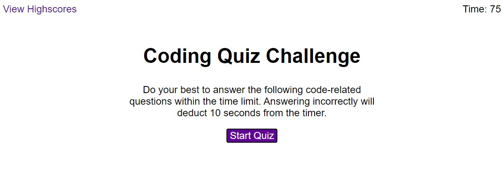
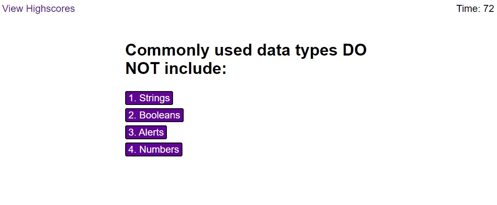
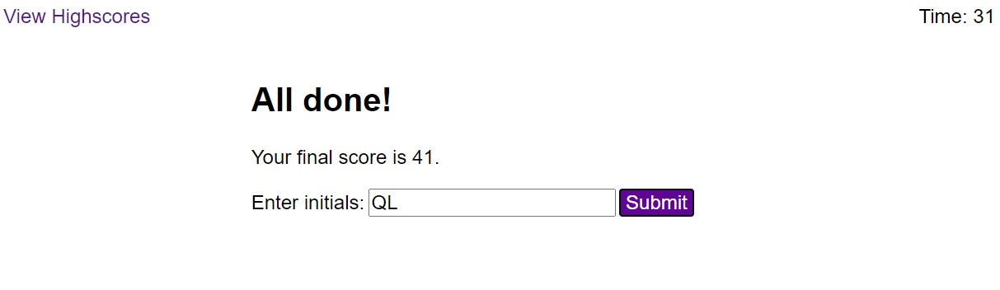
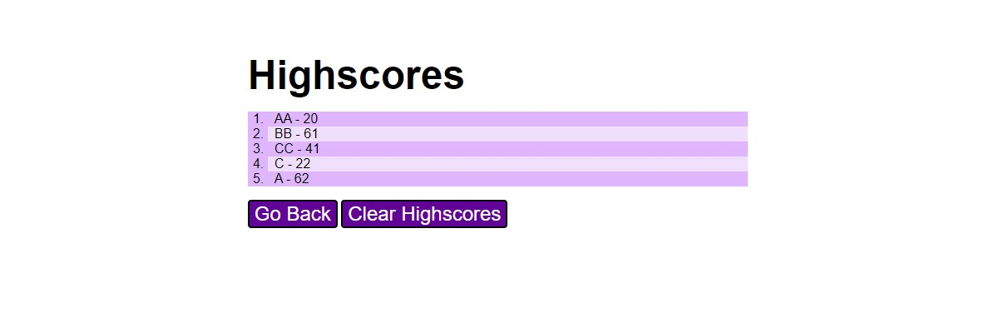

# coding-quiz
This coding quiz is a timed coding assessment with multiple-choice questions, and after finishing the coding quiz, user can enter their initials and see their highscores.

## How To Use Coding Quiz
1. Click on the __Start Quiz__ button. (Figure 1)
2. Answer all 5 questions by selecting on an answer choice. A one-second feedback  will be given below to inform user if they selected the correct or wrong answer. (Figure 2)
3. Enter in your initials at the result page and click on the __submit__ button. Final score is calculated by: 10 points per correct  answer + time remaining. (Figure 3)
4. View the highscore table to see your attempt. If you want, you can clear the highscore table by clicking on __Clear Highscores__. (Figure 4)
5. To return back to the start of quiz, click on __Go Back__ button, and then to return to the highscores from the quiz, click on __View Highscores__ at the top left.

## Additional Pictures
* __Figure 1__: This is the image of the first page once user launches the `index.html`. The __View Highscores__ is located at the top left, and the __timer__ is located at the top right.

* __Figure 2__: Now, this is the image of a question and corresponding answer choices being displayed. At this point. the quiz's timer will run.

* __Figure 3__: This is an image of the result page where user receives their final score and can enter in their initials.

* __Figure 4__: This is an image of highscores page where user can view their highscores.

## How to Run Project
1. Click on [this repository](https://github.com/christylex3/coding-quiz) to open it on GitHub.
2. Then, clone it to your computer.
3. Next, find the `index.html` within the `coding-quiz` folder and open it with Visual Studio Code.
4. Lastly, launch the `index.html` file to see the website, which should look like [this](https://christylex3.github.io/coding-quiz/).